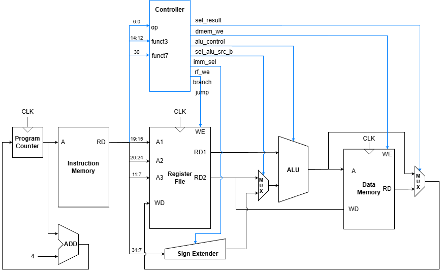

# RISC-V Mini Report

The source code of this project is uploaded to https://github.com/FranziskaSHEN/HardwareProject.

## 1. Decoding Tables

The following tables detail the control signals generated by the `controller` module for the implemented instruction set.

### Main Control Signals

| Instruction | Opcode | `rf_we` | `imm_sel` | `sel_alu_src_b` | `dmem_we` | `sel_result` | `alu_op` | `branch` | `jump` |
| :--- | :--- | :---: | :---: | :---: | :---: | :---: | :---: | :---: | :---: |
| **LW** | `0000011` | 1 | `000` | 1 | 0 | `01` (Mem) | `00` | 0 | 0 |
| **SW** | `0100011` | 0 | `001` | 1 | 1 | `XX` | `00` | 0 | 0 |
| **R-Type** | `0110011` | 1 | `000` | 0 | 0 | `00` (ALU) | `01` | 0 | 0 |
| **I-Type** | `0010011` | 1 | `000` | 1 | 0 | `00` (ALU) | `10` | 0 | 0 |
| **BEQ** | `1100011` | 0 | `010` | 0 | 0 | `XX` | `11` | 1 | 0 |
| **JAL** | `1101111` | 1 | `100` | `X` | 0 | `10` (PC+4) | `XX` | 0 | 1 |
| **LUI** | `0110111` | 1 | `011` | `X` | 0 | `11` (Imm) | `XX` | 0 | 0 |

### ALU Control Decoding

The `alu_control` signal determines the operation performed by the ALU. It is derived from `alu_op`, `funct3`, and `funct7`.

| `alu_op` | `funct3` | `funct7` | Instruction / Type | `alu_control` | Operation |
| :---: | :---: | :---: | :--- | :---: | :--- |
| `00` | `XXX` | `X` | LW, SW | `0000` | ADD |
| `01` | `000` | `00` | ADD | `0000` | ADD |
| `01` | `000` | `20` | SUB | `0001` | SUB |
| `01` | `111` | `X` | AND | `1001` | AND |
| `01` | `110` | `X` | OR | `1000` | OR |
| `01` | `001` | `X` | SLL | `0010` | SLL |
| `01` | `101` | `00` | SRL | `0110` | SRL |
| `01` | `101` | `20` | SRA | `0111` | SRA |
| `01` | `010` | `X` | SLT | `0011` | SLT |
| `01` | `011` | `X` | SLTU | `0100` | SLTU |
| `01` | `100` | `X` | XOR | `0101` | XOR |
| `10` | `000` | `X` | ADDI | `0000` | ADD |
| `10` | `111` | `X` | ANDI | `1001` | AND |
| `10` | `110` | `X` | ORI | `1000` | OR |
| `10` | `001` | `X` | SLLI | `0010` | SLL |
| `10` | `101` | `00` | SRLI | `0110` | SRL |
| `10` | `101` | `20` | SRAI | `0111` | SRA |
| `10` | `010` | `X` | SLTI | `0011` | SLT |
| `10` | `011` | `X` | SLTIU | `0100` | SLTU |
| `10` | `100` | `X` | XORI | `0101` | XOR |
| `11` | `000` | `X` | BEQ | `0001` | SUB |

---

## 2. Implemented RISC-V Program

The following assembly program (`program.s`) was used to verify the processor's functionality, specifically testing memory operations, arithmetic, and branching.

### Code Listing

```assembly
lui     x1, 0x00010         # 1. Load Upper Immediate
addi    x1, x1, 5           # 2. Add Immediate
addi    x2, x0, 20          # 3. Initialize x2
sw      x2, 0(x1)           # 4. Store Word
lw      x3, 0(x1)           # 5. Load Word
add     x4, x3, x2          # 6. Add
sub     x5, x4, x3          # 7. Subtract
beq     x5, x3, branch_target # 8. Branch if Equal
addi    x6, x0, 99          # 9. Skipped instruction
loop1:
    jal     x0, loop1       # 10. Infinite loop (Skipped)
branch_target:
    addi    x6, x0, 42      # 11. Branch Target
loop2:
    jal     x0, loop2       # 12. Final Infinite Loop
```

### Execution Explanation

1.  **`lui x1, 0x00010`**: Loads the upper 20 bits of `0x00010` into `x1`.
    *   `x1` becomes `0x10000` (65536).
2.  **`addi x1, x1, 5`**: Adds 5 to `x1`.
    *   `x1` becomes `0x10005` (65541). This will be used as a memory address.
3.  **`addi x2, x0, 20`**: Loads the immediate value 20 into `x2`.
    *   `x2` becomes `20`.
4.  **`sw x2, 0(x1)`**: Stores the value of `x2` (20) into memory at the address in `x1` (65541).
    *   `Mem[65541] = 20`.
5.  **`lw x3, 0(x1)`**: Loads the value from memory at address `x1` (65541) into `x3`.
    *   `x3` becomes `20`. (This verified the fix for the Load instruction).
6.  **`add x4, x3, x2`**: Adds `x3` (20) and `x2` (20).
    *   `x4` becomes `40`.
7.  **`sub x5, x4, x3`**: Subtracts `x3` (20) from `x4` (40).
    *   `x5` becomes `20`.
8.  **`beq x5, x3, branch_target`**: Compares `x5` (20) and `x3` (20).
    *   Since they are equal, the branch is **taken**. The PC jumps to `branch_target`.
    *   (This verified the fix for the Branch instruction).
9.  **`addi x6, x0, 99`**: This instruction is **skipped** because of the branch.
10. **`loop1: jal x0, loop1`**: This loop is also **skipped**.
11. **`branch_target: addi x6, x0, 42`**: The program resumes here.
    *   `x6` becomes `42`.
12. **`loop2: jal x0, loop2`**: The program enters an infinite loop, effectively terminating the test.

## 3. Full System Diagram

